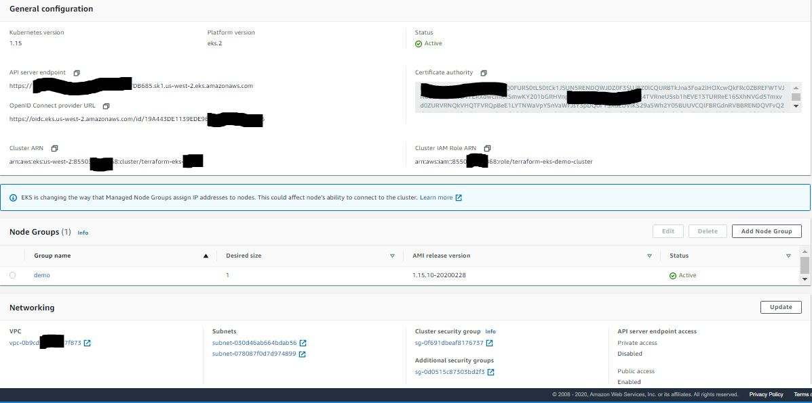
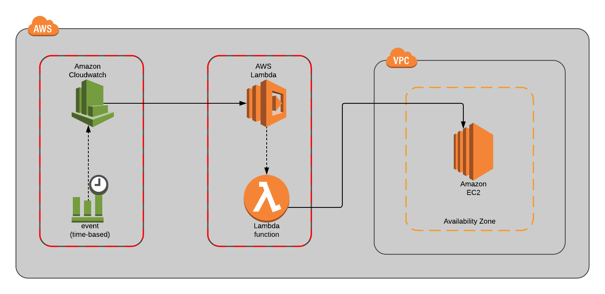
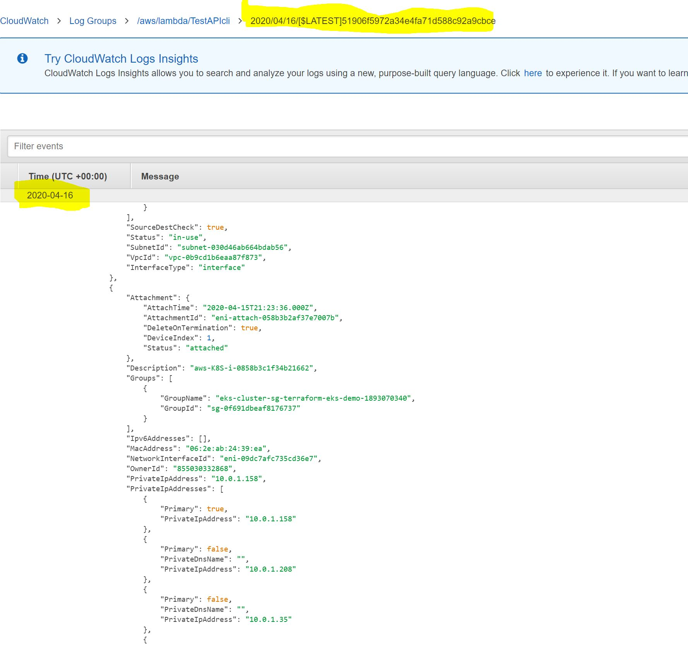

# DevOps Challenge on Hybrid-Cloud

This is a challenge where you can showcase your technical skills and the considerations which you make when performing devops and infrastructure tasks. Your solution may be as simple or complex as you like, provided it meets the requirements below.

### The PART 01
You are to create a web site which can be used for publishing blogs. As a proof of concept, it will be sufficient that you demonstrate a website that displays text (e.g. *Lorem Ipsum* <https://en.wikipedia.org/wiki/Lorem_ipsum> and an image on a single home page.

You can create your own application but can also use an open source or community software, such as Wordpress <https://wordpress.org> or Keystone <http://keystonejs.com> (or even use static content). **This proof of concept is to demonstrate the technical feasibility of hosting and, managing and scaling the platform and is not about content**.

You must meet the following requirements:

- Deliver the tooling to set up an application which displays a web page with *Lorem Ipsum* text and an image
- Provide source code for creating the stack in a publicly available repository e.g. Github (https://github.com)
- Provide and document a mechanism for scaling the service and delivering the content to a larger audience
- Ideally application should be deployed to Kubernetes
- Ideally resources should be created using Terraform
- Provide basic setup documentation to run the application
- Be prepared to explain your choices


*Any solution must demonstrate that you have considered how a real-world solution will be hosted and scaled.

*Also How you host this application is entirely up to you. You can provide tooling to run it locally or link to an instance running in the cloud. Please bear in mind, however, that we are trying to gauge your aptitude for designing and working with web-scale solutions and technologies, so any solution must demonstrate that you have considered how a real-world solution will be hosted and scaled.

### Extended requirements
- Simplest possible solution
- App stack must be portable to any platfor running Kubernetes
- Most cost effective solution
- Quickest to deliver solution
- Easy to scale up/down and upgrade

# One possible solution by Kerem Çeliker
This is a simple solution to the DevOps challenge set above:
- [KubeCtl-KoobCuttle](https://docs.aws.amazon.com/eks/latest/userguide/install-kubectl.html) will be used to provision infrastructure on a local machine for the testing of WordPress stack
- [Amazon EKS for AWS](https://aws.amazon.com/eks/), _which is based on a CloudFormation template_, will be used to provision Kubernetes infrastructure in AWS. This infrastructure will be used for public Web-Site
- Kubernetes will be used both as a container and orchestration technologies for standing up Web-Site stack. The provided K8s yaml file will run anywhere Kubernetes POD and K8s NameSpaces is installed. So, it is cloud / platform agnostic
  - Kubernetes version 1.15.x was used for testing this solution

### 1) Local infrastructure:
1.1) *Assumptions:*
- Development machine is a Windows 10 Pro.
- User has admin privileges on the machine
- At least 15GB of free RAM is available on the development machine. Otherwise, Visual Code Studio will need editing to adjust available memory:
  -	`v.customize ["modifyvm", :id, "--memory", <MEMORY_ALLOCATION>]`

1.2) *Prerequisites:*
  -	Install latest version of  [Git bash](https://git-scm.com/downloads) for Windows Setup (As like me)
  -	Install latest version of [VMware Workstation](https://www.vmware.com/products/workstation-pro/workstation-pro-evaluation.html) => Not Really Required, Only It's up to you.
  -	Install latest version of  [Visual Studio Code](https://code.visualstudio.com/download)
  - Install latest version of [Terraform CLI](https://www.terraform.io/downloads.html)
  - Install latest version of [AWS CLI](https://docs.aws.amazon.com/cli/latest/userguide/cli-chap-configure.html)
  - Install latest version of [KubeCtl - Kubernetes CLI](https://docs.aws.amazon.com/eks/latest/userguide/install-kubectl.html)

1.3) *Instructions:*
  - `git clone https://github.com/keremceliker/Publish-a-Serverless-WebSite-on-Kubernetes-from-Amazon-AWS-by-Terraform.git`
  - `cd Publish-a-Serverless-WebSite-on-Kubernetes-from-Amazon-AWS-by-Terraform`
  -	Run ```K8s Pod up``` command which will setup a Worker Node cluster; 1 x Master (Owned by EKS) and 1xWorker. Once infrastructure is created then in gitbash, run ```Terraform init ssh K8s node``` to log into the EKS node. This is where Serverless Web-Site stack will need to be deployed
  - Infrastructure visualizer is available at [http://node:8080/api/](http://node:8080/api/). You should see only 1 nodes one of which is a Kubernetes Worker Node <br /> 

  - `cd /Publish-a-Serverless-WebSite-on-Kubernetes-from-Amazon-AWS-by-Terraform`
  - Next, move on to the "Deploy Serverless Web-Site stack" section below in order to deploy Kubernetes Web stack

### 2) AWS infrastructure with Kubernetes:
2.1) *Create a new VPC:*

This approach creates a new VPC, subnets, gateways, and everything else needed in order to run EKS for AWS. It is the easiest way to get started, and requires the least amount of work. All you need to do is run the CloudFormation template, answer some questions, and you are good to go.

2.2) *Prerequisites:*
- SSH key in AWS in the region where you want to deploy (required to access the completed Kubernetes install)
- Access to an AWS account with permissions to use CloudFormation and creating the following objects
  - EC2 instances + Auto Scaling groups (+If you want it but Not Required)
  - IAM profiles
  - Lambda for Cloud Function
  - VPC + subnets and security groups
  - CloudWatch Log Row Data Group 

2.3) *Instructions:*

- Instructions on how to create a Kubernetes cluster in AWS is fully documented at https://www.terraform.io/docs/providers/aws/d/eks_cluster.html For the purpose of creating this solution, [Data Source: AWS_EKS_Cluster](https://learn.hashicorp.com/terraform/aws/eks-intro) was used by HashiCorp Terraform.
- Once AWS infrastructure is created, connect to your manager node by following instructions at https://docs.aws.amazon.com/eks/latest/userguide/network_reqs.html
  - eval $(ssh-agent -s) or ssh-agent -s
  - ssh-add path-to-ssh-key
  - ssh -i path-to-ssh-key kube@ssh-manager-host
- EC2 instances just created are Alpine AWS Linux based. Git client will need to be installed by running `sudo apk update && sudo apk add git && sudo apk add openssl`
- Start visualizer service by running
```
For Ubuntu Linux as the follows below;

kubernetes service create \
--name=visualizer \
--publish=9080:8080/tcp \
--constraint=node.role==manager \
--mount=type=bind,src=/var/run/kubernetes.sock,dst=/var/run/kubernetes.sock \
samples/website
```
```
For Windows as the follows below;

#Git> Terraform --version
#Git> Terraform init (Initializing the backend)
#Git> Terraform plan
#Git> Terraform apply
#Git> terraform state list
#Git> terraform output kubeconfig (This Kube Config must be same according to Output.tf from Terraform Code)
```


This visualizer should then be available at http://DefaultDNSTarget:8081 which you should be able to look up on AWS CloudFormation page.  
      - In my case it was - 
- `git clone https://github.com/keremceliker/Publish-a-Serverless-WebSite-on-Kubernetes-from-Amazon-AWS-by-Terraform/tree/master/DevOps_Challenge_on_HybridCloud.git`
- `cd /DevOps_Challenge_on_HybridCloud`
- Move on to the "Deploy a Static WebSite or WordPress stack" section below in order to deploy Static WebSite

### 3) Deploy Static Web-Site stack
Once you have a Kubernetes cluster / infrastructure up and running, ssh on to the master node in gitbash. Then create secrets to be used with Web-Site and then deploy Hello Kubernetes Web Site stack using a simple cli. Follow these instructions:
1. `kubectl get pods`
2. `Create a Yaml Script for Serverless Web-Site and make upload to Terraform Stack Source`
3. `kubectl apply -f hello-k8s-deploy.yaml`
4. `kubectl get svc`. Wait a couple second until all Pods and Replicas are reported as deployed.

```You must be see as the follows information
NAME                            TYPE           CLUSTER-IP       EXTERNAL-IP                                        PORT(S)        AGE
Serverless-ExampleWebSite     LoadBalancer   172.20.165.98      2020GonnaBePERFECT.us-west-2.elb.amazonaws.com     80:31958/TCP   2m26s
kubernetes                    ClusterIP      172.20.0.1         <none>                                             443/TCP        59m
```


### 4) Configure Serverless a Static Web-Site
- Navigate to [http://node1](http://node1) for local infrastructure or for AWS the URL is http://DefaultDNSTarget which you should be able to look up on CloudFormation service page
  - In my case it was - [https://us-west-2.console.aws.amazon.com/eks/home?region=us-west-2#/clusters/) for AWS to configure a WebSite or WordPress
- Configure you language and press continue button
- Configure user credentials and press install button
- Once configuration is successful, log in with your credentials
- Create your first blog

### 5) Rotate a secret
- In this scenario, you create a new secret with a new MySQL password, update the mysql and wordpress services to use it, then remove the old secret.
- Use the instructions here: https://aws.amazon.com/tr/blogs/security/how-to-rotate-a-wordpress-mysql-database-secret-using-aws-secrets-manager-in-amazon-eks/

### 6) Clean up
- **Terraform** - Exit the Kubernetes master node and execute `terraform destroy` to destroy virtual kubernetes boxes
- **AWS** -  Delete the stack from the CloudFormation service page

### 7) References
- [Terraform for AWS Code](https://learn.hashicorp.com/terraform/aws/eks-intro)
- [EKS Kubernetes for AWS](https://aws.amazon.com/eks/)
- [Use secrets with a WordPress service](https://aws.amazon.com/tr/blogs/security/how-to-rotate-a-wordpress-mysql-database-secret-using-aws-secrets-manager-in-amazon-eks/)

### The PART 02
Create Cloud Function (or AWS Lambda) that lists all VPCs and Subnets in the project (or account) and saves the data in the database (you can choose the database as well as the format in which you want to save the data).

 <br /> 

1) *Instructions for AWS Lambda Cloud Function:*

  - Create a New Lambda Cloud Function
    In my case it was - `[Configuring Functions in the AWS Lambda Console]` (https://docs.aws.amazon.com/lambda/latest/dg/configuration-console.html) for the purpose of creating this solution,
  - Define IAM permissions to the configuration that the function will read. 
	`Only the necessary IAM permission must be given. I'm currently passing by full read permission.`
  - Paste the code to Node.Js for the describeInstances parameter to which the information will be withdrawn
```
exports.handler = async (event) => {
    // TODO implement
    const response = {
        statusCode: 200,
        body: JSON.stringify('This is Blank Test API from Lambda!'),
    };
    return response;
};

var AWS = require('aws-sdk');  
AWS.config.region = 'us-west-2';  

exports.handler = function(event, context) {  
    console.log("\n\nLoading handler\n\n");
    var ec2 = new AWS.EC2();
    ec2.describeInstances(function(err, data) {
        console.log("\nIn describe instances:\n");
        if (err) console.log(err, err.stack); // an error occurred
        else     console.log("\n\n" + JSON.stringify(data) + "\n\n"); // successful response
  
context.done(null, ' Retrieved all EC2s, VPCs and Subnets Row Data in the project and written to Log DB by CloudWatch !');
    });
};

```
  
  - Test The Function first and Then Save
  

2) *Instructions For Written Row Data by Cloud Watch:*

  - Get from Log Stream to the latest Row Data Stream you tested
  - Find the data that says as follows:
  `2020-04-16T23:54:46.896Z 8f7ba0a1-be35-4e4a-9631-3cc941182aaa INFO {"Reservations":[{"Groups":[],"`
  - When you expand, if you encounter a Row Data like the following, you've got all the information in bulk.
 <br /> 
  

# An alternative solution _(Deploy WordPress using AWS Elastic Beanstalk)_
Launch a web stack to host your WordPress application using AWS Elastic Beanstalk and Amazon Relational Database Service (RDS). Elastic Beanstalk provisions and manages the underlying infrastructure (e.g., Amazon EC2 instances) and stack components (e.g., OS, web server, language/framework) for you. RDS provides the MySQL database.

This architecture is based on the _"Deploy and host a production-ready WordPress website on AWS"_ guide at https://aws.amazon.com/getting-started/projects/build-wordpress-website/

<p align="center">
  
</p>

**This alternative solution was reject for the following reasons:**
- No automation as infrastructure would need to be set up manually
   - One could write Terraform and Ansible scripts to automate provisioning of the infrastructure and installing WordPress. However, this would require additional technical skills and add an other layer of complexity to the solution
- Increased complexity as extensive AWS knowledge would be required
- Increased effort in maintaining infrastructure
- Lock in to AWS technologies and blogs site will not be easily portable
